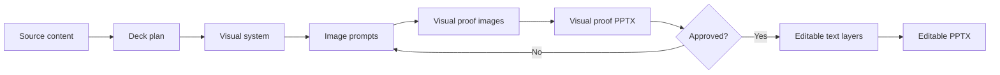

<div align="center">

# Super PPT with ChatGPT Image 2

**Plan first. Generate the visual proof. Then ship an editable PowerPoint.**

<p>
  <a href="#quick-start"></a>
  <a href="#two-stage-pipeline"></a>
  <a href="#中文说明"></a>
</p>

<p>
  <strong>Default language: English.</strong>
  <br>
  Use the Chinese toggle below for the bilingual version.
</p>

</div>

<details>
<summary><strong>中文说明，点击切换语言</strong></summary>

## Super PPT with ChatGPT Image 2

这是一个面向 Codex 的 **Super PPT skill**，目标是把原始内容变成高质量、视觉统一、可审阅、可编辑的 PowerPoint。

核心原则：先确认纯图视觉方案，再生成可编辑版本。

工作流分两步：

1. **Visual Proof**：先用 `gpt-image-2` 为每一页生成全幅视觉图，组装成 `super-ppt-visual.pptx`，用于检查叙事、配色、版式、风格一致性。
2. **Editable PPT**：视觉方案确认后，复用已批准的图片作为背景，再把标题、要点、数字、引用等关键内容作为 PowerPoint 可编辑文字层覆盖到 `super-ppt-editable.pptx`。

为什么这样做：

- 图像模型擅长视觉构图和风格表达。
- PowerPoint 擅长精确文字、数字、引用和后期修改。
- 两阶段拆分可以避免一次生成里同时追求“好看”和“完全可编辑”导致的不稳定。

快速使用：

```bash
python3 super-ppt/scripts/super_ppt_pipeline.py examples/product-strategy.plan.json --dry-run

python3 super-ppt/scripts/super_ppt_pipeline.py examples/product-strategy.plan.json \
  --output super-ppt-visual.pptx \
  --image-dir images \
  --model gpt-image-2 \
  --skip-editable

python3 super-ppt/scripts/super_ppt_pipeline.py examples/product-strategy.plan.json \
  --output super-ppt-visual.pptx \
  --editable-output super-ppt-editable.pptx \
  --image-dir images \
  --model gpt-image-2 \
  --reuse-images
```

注意：当前可编辑版本采用“图片背景 + 可编辑文字层”的实用路线。若需要所有图形、图标、图表都变成 PowerPoint 原生对象，需要额外的完整 shape rebuild workflow。

</details>

## What This Is

Super PPT is a Codex skill for creating visually consistent presentation decks with a practical, stable generation workflow:

1. Turn source material into a structured deck plan.
2. Define one visual system for the whole deck.
3. Generate a pure-image visual proof deck with `gpt-image-2`.
4. Review and approve the visual direction.
5. Build an editable PowerPoint version from the approved visuals.

It is designed for strategy decks, teaching decks, product briefs, research summaries, pitch narratives, and any workflow where visual polish matters but the final deck still needs editable text.

## Why Two Stages

Most AI presentation pipelines mix too many jobs into one step: narrative planning, visual design, exact typography, numbers, citations, and PowerPoint editing. That creates unstable results.

This project splits the work:

- **GPT Image handles visual design:** composition, hierarchy, mood, diagrams, UI motifs, background rhythm.
- **PowerPoint handles exact editability:** titles, bullets, numbers, citations, labels, and later manual edits.

The result is less magical but much more reliable.

## Two-Stage Pipeline



## Repository Layout

```text
.
├── README.md
├── requirements.txt
├── examples/
│   └── product-strategy.plan.json
└── super-ppt/
    ├── SKILL.md
    ├── agents/
    │   └── openai.yaml
    ├── references/
    │   ├── deck-planning.md
    │   ├── editable-ppt.md
    │   └── visual-system.md
    └── scripts/
        └── super_ppt_pipeline.py
```

## Quick Start

Install dependencies:

```bash
pip install -r requirements.txt
```

Validate the plan and inspect prompts before spending on generation:

```bash
python3 super-ppt/scripts/super_ppt_pipeline.py examples/product-strategy.plan.json --dry-run
```

Generate only the pure-image visual proof:

```bash
python3 super-ppt/scripts/super_ppt_pipeline.py examples/product-strategy.plan.json \
  --output super-ppt-visual.pptx \
  --image-dir images \
  --model gpt-image-2 \
  --skip-editable
```

After visual approval, build the editable version from the approved images:

```bash
python3 super-ppt/scripts/super_ppt_pipeline.py examples/product-strategy.plan.json \
  --output super-ppt-visual.pptx \
  --editable-output super-ppt-editable.pptx \
  --image-dir images \
  --model gpt-image-2 \
  --reuse-images
```

## Quality Controls

- **Plan-first:** every slide has a role, takeaway, and visual intent.
- **Visual-system lock:** palette, typography hints, UI motifs, and negative rules repeat across all prompts.
- **Visual proof gate:** review the image deck before building the editable deck.
- **Editable text layer:** exact wording is added in PowerPoint, not trusted to image pixels.
- **Manifest output:** prompts, image paths, model, size, quality, and slide QA notes are tracked.
- **Targeted regeneration:** fix weak slides one at a time instead of rebuilding the whole deck.

## Editable Output

The editable deck uses approved generated images as slide backgrounds and adds important text as PowerPoint text boxes.

This makes the deck practical to edit while preserving the visual quality of the image model. It does not attempt to convert every generated visual element into native PowerPoint shapes.

Use a dedicated shape-rebuild workflow if you need every diagram, icon, and chart to be fully editable.

## Plan File

Each deck starts with a `plan.json` file. The most important fields are:

- `deck.generation_mode`: use `hybrid_editable_text` by default.
- `visual_system.palette`: shared colors with hex values.
- `slides[].takeaway`: one message per slide.
- `slides[].visual_intent`: what the slide must make obvious.
- `slides[].editable_elements`: exact PowerPoint text overlays.

See [examples/product-strategy.plan.json](examples/product-strategy.plan.json).

## Requirements

- Python 3.10+
- `OPENAI_API_KEY` for image generation
- `openai`
- `python-pptx`

## Status

This is an early, pragmatic workflow. It is optimized for controllability and reviewability, not for pretending that a generated raster image can magically become a perfect native PowerPoint file.

The guiding rule is simple:

> Approve the image first. Edit the PowerPoint second.
